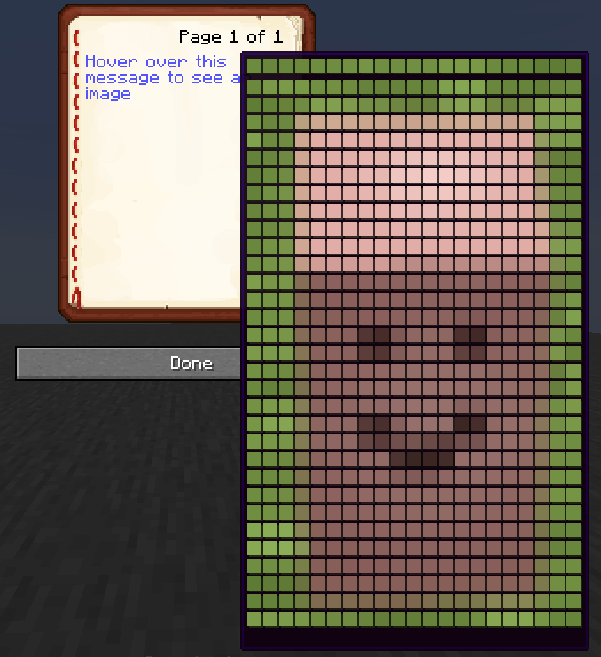
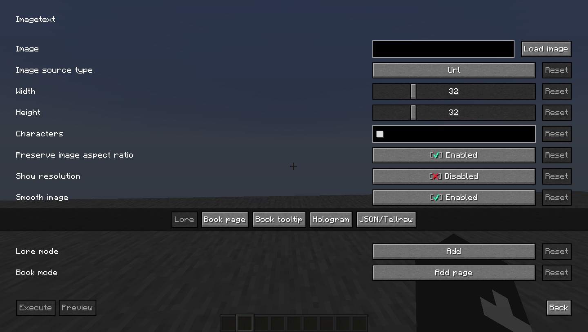
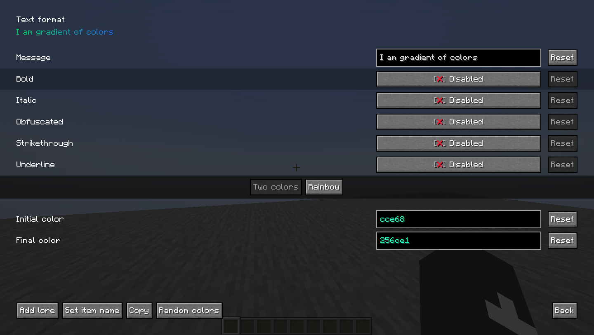
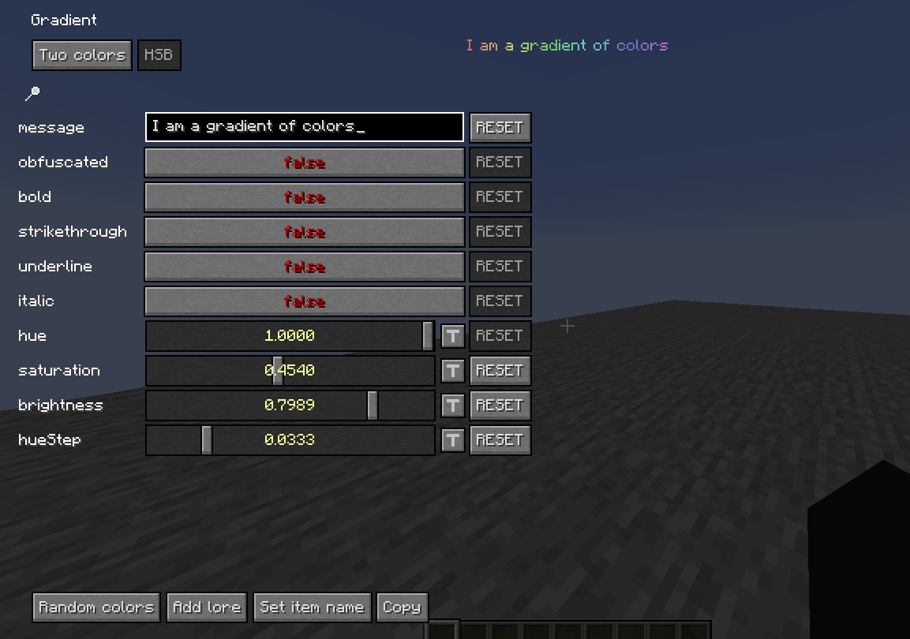
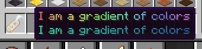
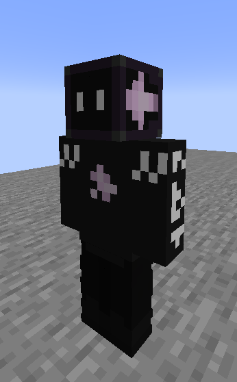
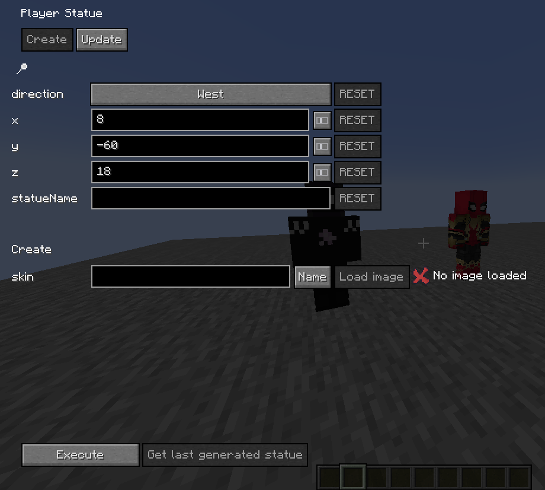
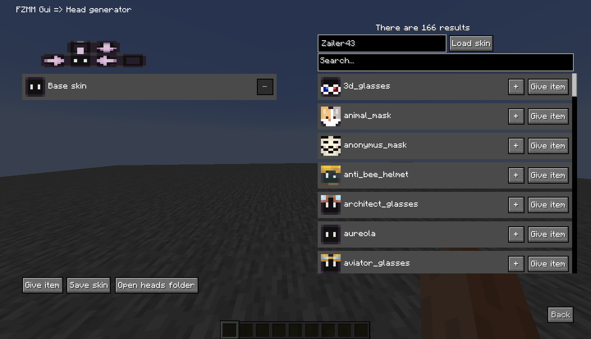
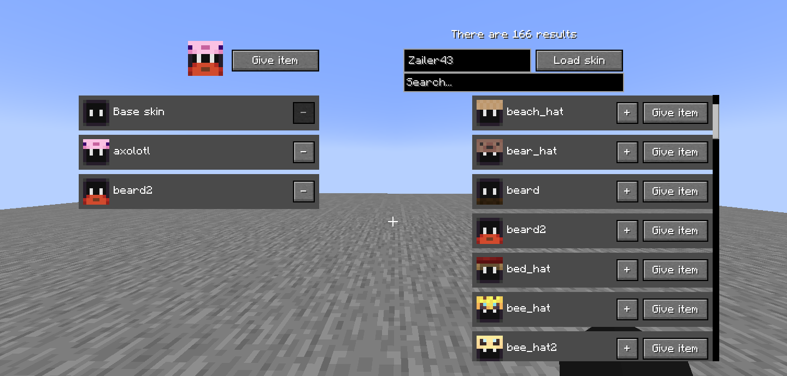
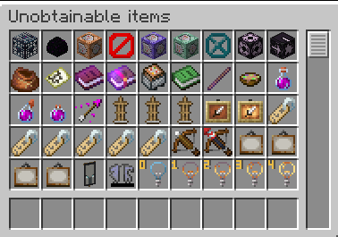

# FZMM-Mod (WIP)

A fabric mod that is mainly for editing or creating NBT of items in creative, but it also has a few utilities.

## Imagetext
A generator of colored characters that make an image.

Images

### Lore 

### Book page

### Book tooltip

### Hologram

### GUI

## Gradient
To be able to create gradients for the texts.

Note: when doing this I didn't know [PlaceHolderAPI](https://github.com/Patbox/FabricPlaceholderAPI), so it is possible that in the future I will improve it using that.

Images

### Two colors

### HSB (rainbow)

### Item example

## Player Statue
Player Statue is 26 invisible armor stands with heads on their hands making a skin together.

It also allows 128x128 skins.

[Player statue original](https://statue.jespertheend.com/)

Images

### Skin 64x64

### Skin 128x128

### Armor stands

### GUI

## Head generator
Modify skins in seconds and get the head instantly, you can add accessories like glasses, hats, helmets, masks, beards, etc.

Disclaimer: the second layer of the original skin is removed (for now).

Images

### GUI

### Examples

## Item groups

### Unobtainable items

The real list of unobtainable items and not the list of generic mods
It includes:
- Armor stand with arms
- Small armor stand
- Small armor stand with arms
- Invisible item frame
- Invisible glow item frame
- Special name tags with the description of use for each one
- Unobtainable paints (1.19+)
- All light states

### Useful block states

A list of items that I think can be useful or at least curious/fun, these items have a tag called [BlockStateTag](https://minecraft.fandom.com/wiki/Block_states) that modifies their properties when placed.

### Loot chests

All types of loot chest, or in other words: a list of chests which each time you open one for the first time has a different loot and all the chests there have different odds and items.

### Player heads

A list of heads of all connected players.