# FZMM-Mod

A fabric mod that is mainly for editing or creating NBT of items in creative, but it also has a few utilities.

## How to use?
The default key to use the mod is `Z` (can be changed in controls), there are also some client-side commands with `/fzmm`

## Dependencies
* [owo-lib](https://modrinth.com/mod/owo-lib)
* [Fabric API](https://modrinth.com/mod/fabric-api)

## Features

### Head generator
Modify heads in seconds and get the skin instantly, with the "textures" option you can add accessories, glasses, hats, masks, beards, etc.
and with the "models" option you can turn your skin into a plushie/mini version, put a pixel art of your skin on a book cover, decapitated and add accessories with the color of your choice.

Currently, the default resource pack comes with:

- 219 texture heads
- 21 model heads

#### Examples

 
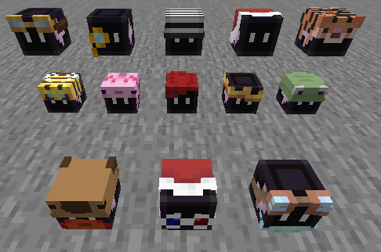

Images

#### GUI

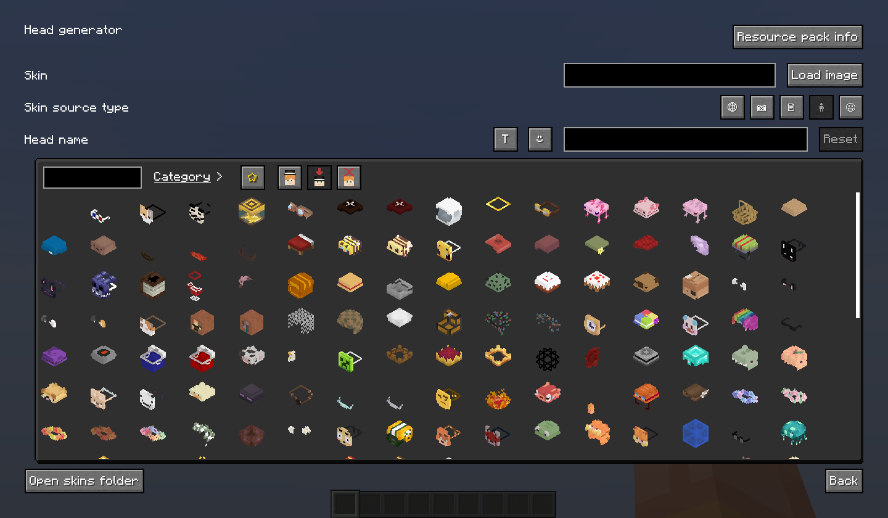

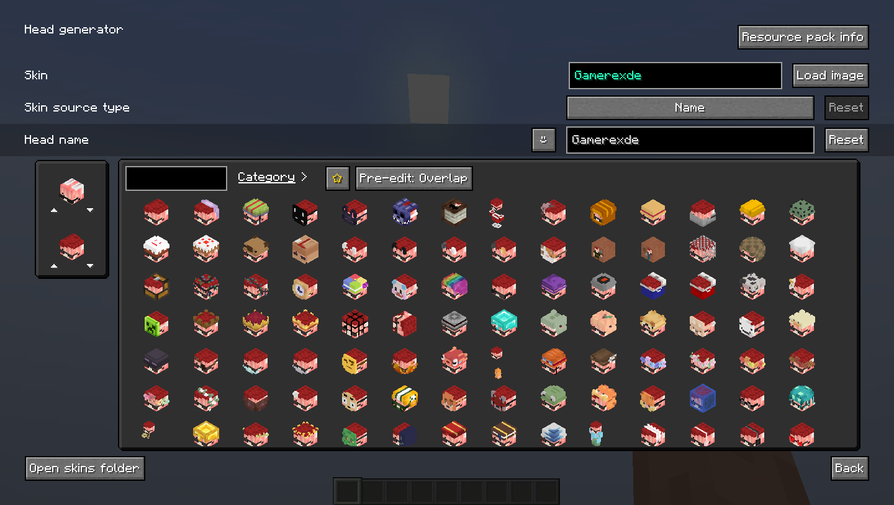

### Imagetext
An image formed by colorful characters, supports many types of display and resolution up to 127x127 of the image as a result.

Types of display:

* Lore
* Book page
* Book tooltip
* Hologram (armor stands)
* Sign 

#### Lore

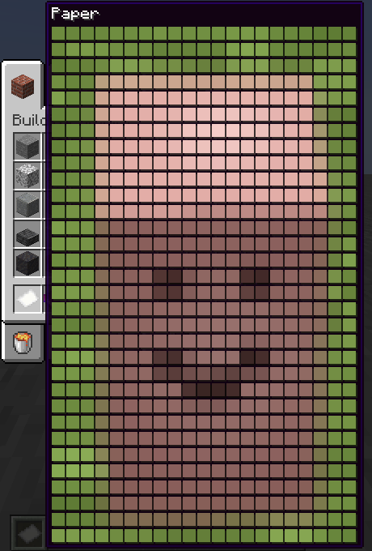

Images
 

#### Book page

#### Book tooltip

#### Hologram

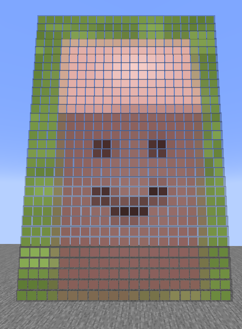

#### Sign

#### GUI

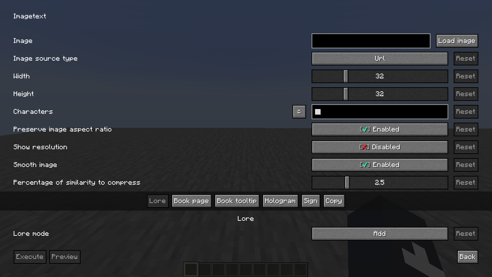

### Text format
Formatting of texts with colors, symbols, etc.

Types of formatting:

* Simple
* Gradient
* Rainbow
* Interleaved
* [Placeholder API](https://github.com/Patbox/TextPlaceholderAPI)

#### Item example

Images

#### Gradient

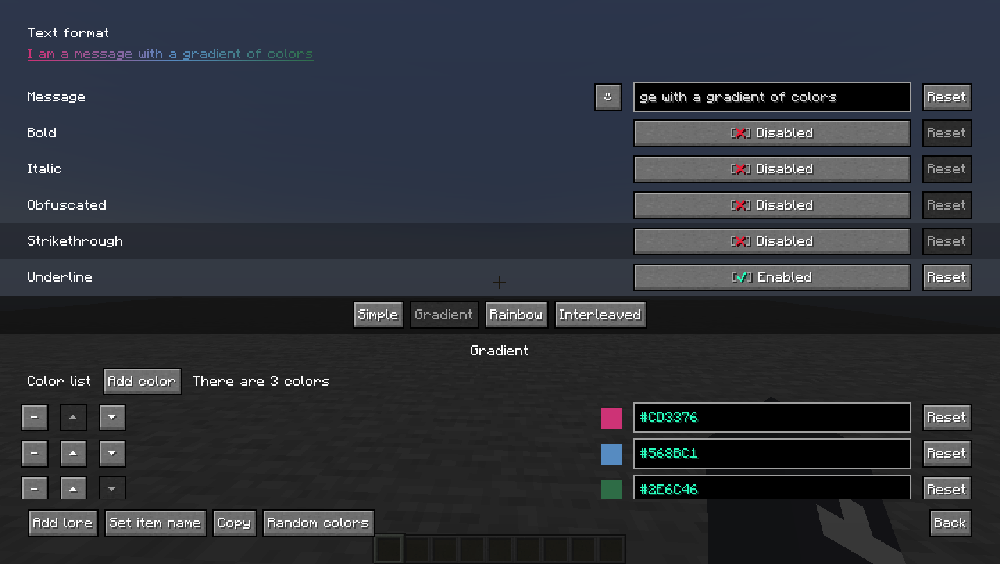

#### Rainbow

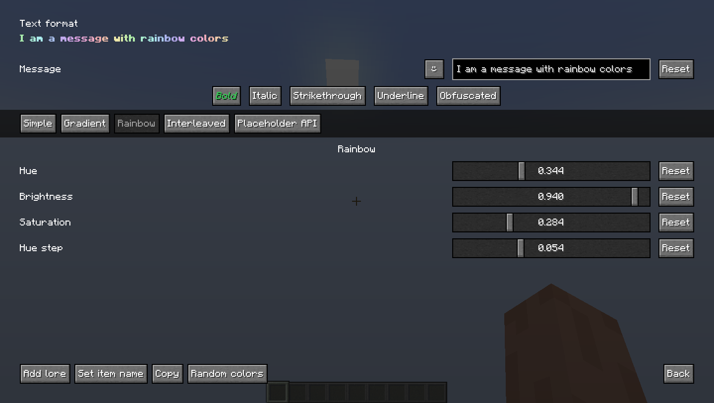

#### Interleaved

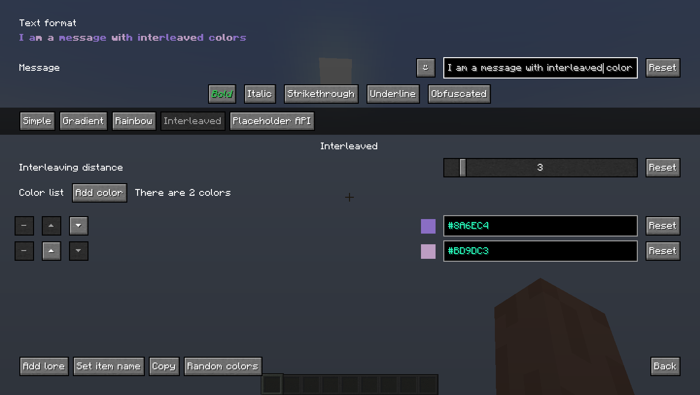

### Player Statue
Player Statue is 26 invisible armor stands with heads on their hands making a skin together.

It also allows 128x128 skins.

[Player statue original](https://statue.jespertheend.com/)

#### Armor stands

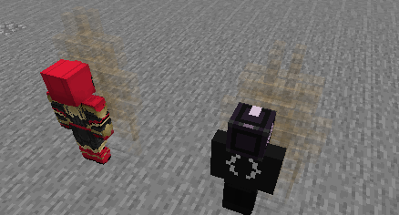

Images

#### Skin 64x64

#### Skin 128x128

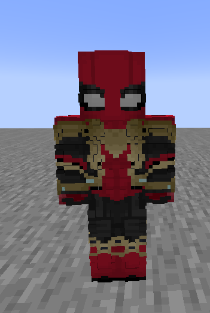

#### GUI

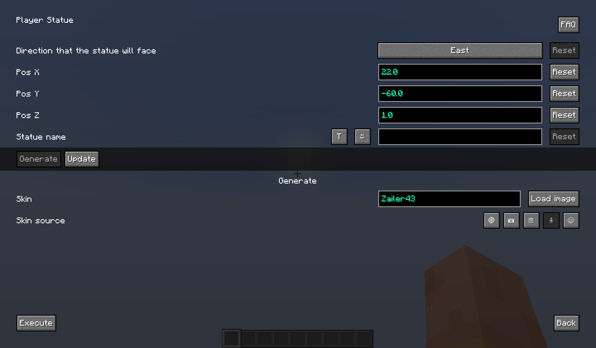

### Head gallery
A gallery of 50,000+ heads provided by [Minecraft heads](https://minecraft-heads.com)

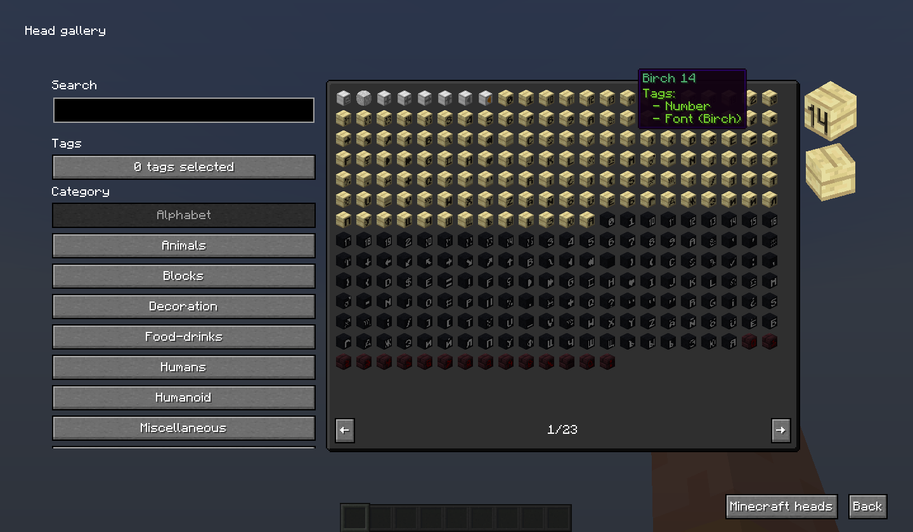

Images

#### Tags
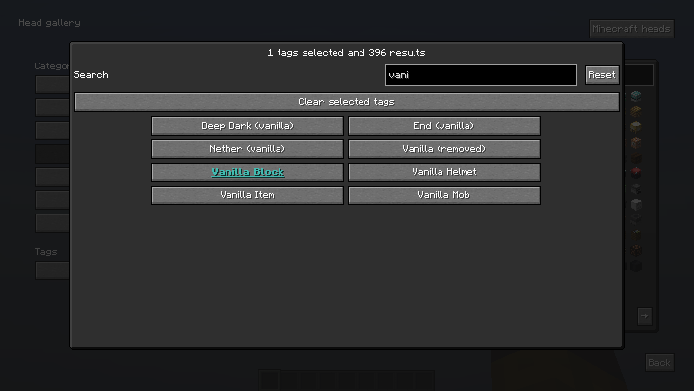

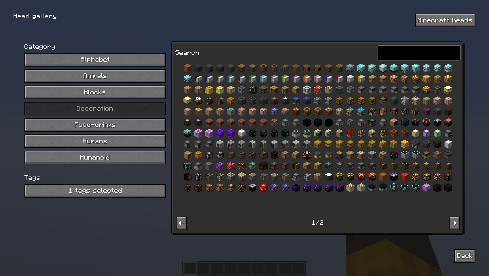

#### Search
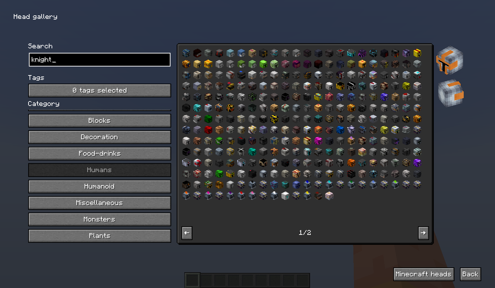

### Banner editor
A banner editor is easier than having to place a loom and search for items, plus it is more convenient to use, and you can preview the banners better. It also has the option to change the color of the pattern you click and remove the pattern you want.

#### Add patterns

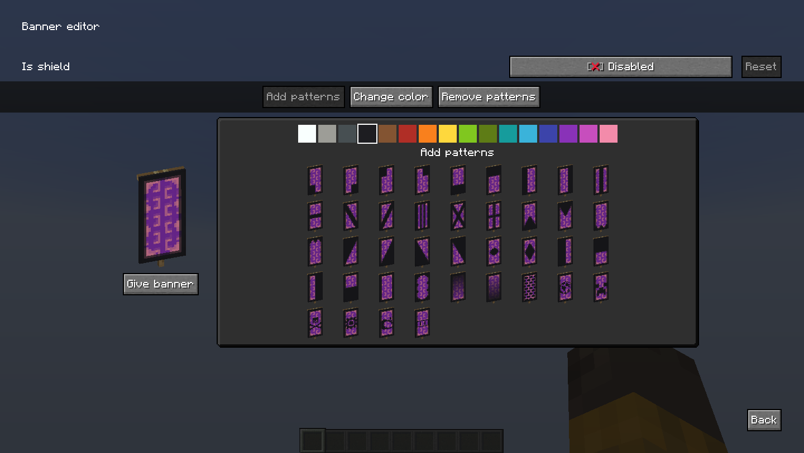

Images

#### Change color

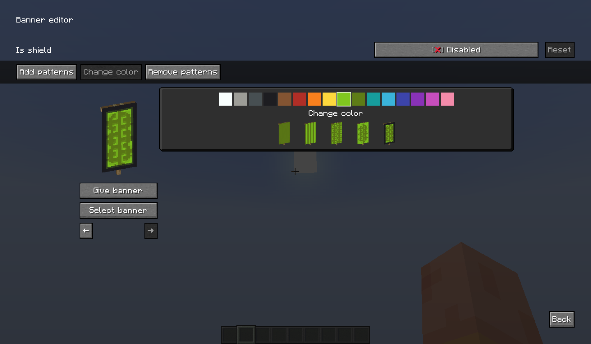

#### Shield

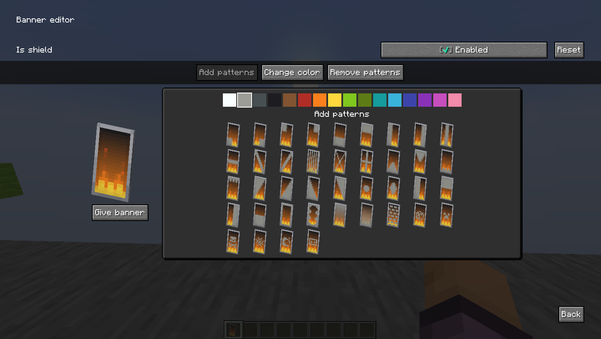

### Encryptbook
Encryptbook is based on the concept of encrypting text with translations and being able to decrypt it with resource pack, it may not be very secure, but it can be decrypted from vanilla.

More info at: [Encryptbook wiki](docs/en/wiki/encrypt_book/README.md)

### Item groups

#### Operator utilities

An improved version of the one provided by Minecraft 1.19.3
It includes:

- Access only with creative, **op is not required**
- Armor stand with arms
- Small armor stand
- Small armor stand with arms
- Invisible item frame
- Invisible glow item frame
- Special name tags with the description of use for each one
- Unobtainable paints (1.19+)
- Petrified oak slab (removed from creative inventory in 1.19.3)

Note: the items op tab must be enabled in the vanilla configuration in order to view it.

#### Useful block states

A list of items that I think can be useful or at least curious/fun, these items have a tag called [BlockStateTag](https://minecraft.fandom.com/wiki/Block_states) that modifies their properties when placed.

#### Loot chests

All types of loot chest, or in other words: a list of chests which each time you open one for the first time has a different loot and all the chests there have different odds and items.

## Incompatibilities

### Resource packs

* Resource packs that modify how the heads look in the hands as it affects how the Player Statue looks
  Examples:
  - [Corrected Mob Heads](https://modrinth.com/resourcepack/corrected-mob-heads)
  - [Shelf+](https://www.curseforge.com/minecraft/texture-packs/shelf)

## Translations
To contribute with the translation of a language or fix a bug in a language other than English you must use the [Crowdin project of the mod](https://crowdin.com/project/fzmm-mod), if you don't find your language, and you want to translate it you can suggest it with an issue or post it in discord.

## Special thanks to:
- [Mineskin](https://mineskin.org) for being able to make Player Statue and Head Generator possible thanks to their API
- [Logstone & Jespertheend](https://statue.jespertheend.com) for creating Player Statue (or at least doing something known)
- [owo-lib](https://github.com/wisp-forest/owo-lib) and its contributors for making a fairly complete library
- [Minecraft heads](https://minecraft-heads.com) for having a great gallery of heads for Head Gallery
- [Placeholder API](https://github.com/Patbox/TextPlaceholderAPI) for having an easy-to-use format for text formatting
- [Symbol Chat](https://modrinth.com/mod/symbol-chat) for being a good complement for texts
- turkeybot69 for having the crazy idea of encrypting messages with translations
- The past, present and future contributors of FZMM mod, including people who report bugs or give me suggestions 

## Disclaimer

The purpose of this mod is not to hack servers or anything related to exploits or bugs, it is simply a free tool to generate items, I am not responsible for what people do with those tools, nor will they be added features that can't be used creatively without damaging a server or players.
