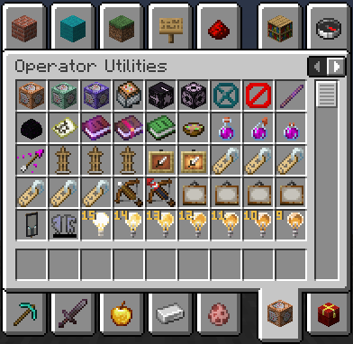

# FZMM-Mod (WIP)

A fabric mod that is mainly for editing or creating NBT of items in creative, but it also has a few utilities.

## How to use?
The default key to use the mod is `Z` (can be changed in controls), there are also some client-side commands with `/fzmm`

## Dependencies
* [owo-lib](https://modrinth.com/mod/owo-lib)
* [Fabric API](https://modrinth.com/mod/fabric-api)

## Imagetext
A generator of colored characters that make an image.

Images

### Lore 

### Book page

### Book tooltip

### Hologram

### GUI

## Gradient
To be able to create gradients for the texts.

Note: when doing this I didn't know [PlaceHolderAPI](https://github.com/Patbox/FabricPlaceholderAPI), so it is possible that in the future I will improve it using that.

Images

### Two colors

### Rainbow

### Item example

## Player Statue
Player Statue is 26 invisible armor stands with heads on their hands making a skin together.

It also allows 128x128 skins.

[Player statue original](https://statue.jespertheend.com/)

Images

### Skin 64x64

### Skin 128x128

### Armor stands

### GUI

## Head generator
Modify skins in seconds and get the head instantly, you can add accessories like glasses, hats, helmets, masks, beards, etc.

Images

### GUI

### Examples

## Item groups

### Operator utilities

An improved version of the one provided by Minecraft 1.19.3
It includes:

- Access only with creative, **op is not required**
- Armor stand with arms
- Small armor stand
- Small armor stand with arms
- Invisible item frame
- Invisible glow item frame
- Special name tags with the description of use for each one
- Unobtainable paints (1.19+)
- Petrified oak slab (removed from creative inventory in 1.19.3)

### Useful block states

A list of items that I think can be useful or at least curious/fun, these items have a tag called [BlockStateTag](https://minecraft.fandom.com/wiki/Block_states) that modifies their properties when placed.

### Loot chests

All types of loot chest, or in other words: a list of chests which each time you open one for the first time has a different loot and all the chests there have different odds and items.

## Incompatibilities

### Resource packs

* Resource packs that modify how the heads look in the hands as it affects how the Player Statue looks
  Examples:
  - [Corrected Mob Heads](https://modrinth.com/resourcepack/corrected-mob-heads)
  - [Shelf+](https://www.curseforge.com/minecraft/texture-packs/shelf)

## Translations
To contribute with the translation of a language or fix a bug in a language other than English you must use the [Crowdin project of the mod](https://crowdin.com/project/fzmm-mod), if you don't find your language and you want to translate it you can suggest it with an issue or post it in discord.

## Special thanks to:
- [Mineskin](https://mineskin.org) for being able to make Player Statue and Head Generator possible thanks to their API
- [Logstone & Jespertheend](https://statue.jespertheend.com) for creating Player Statue (or at least doing something known)
- [owo-lib](https://github.com/wisp-forest/owo-lib) and its contributors for making a fairly complete library
- The past, present and future contributors of FZMM mod, including people who report bugs or give me suggestions 

## Disclaimer

The purpose of this mod is not to hack servers or anything related to exploits or bugs, it is simply a free tool to generate items, I am not responsible for what people do with those tools, nor will they be added features that can't be used creatively without damaging a server or players.
