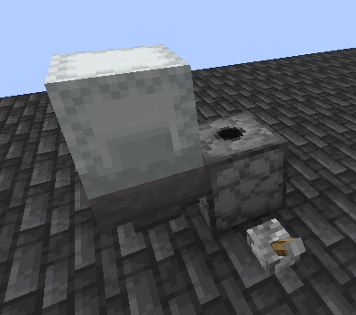
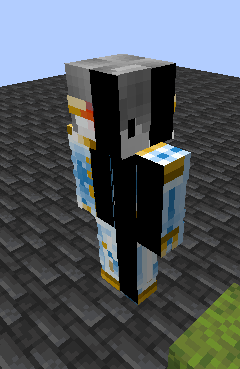

## Before generating any statue I recommend that you bear in mind that they can be difficult to remove
In case you place it in singleplayer you have the following options:
* `/kill @e [tag=PlayerStatue]` Kill all statues in the world
* `/kill @e [tag=PlayerStatue,distance=..3]` Kill all statues within 3 blocks
* `/data merge entity @e [tag=PlayerStatue,limit=1,sort=nearest] {Invisible:0b}` Remove the invisibility from a part of the statue so that you can remove it by hitting it (There are some armor stands which are invisible, so if you hit them it won't remove them)

If it is on a server you can:
* Check if the ArmorStandEditor plugin exists (take a flint and right click)
  if it does, then in the menu that's opened click "invisible" (or something like that)
  Then take the flint, hit an armor stand, then switch to something else and hit the armor stand, and it should be removed.
  repeat until no armor stands remain.
* If there are plots as the last measure you can use /plot clear (Not recommended)
* Cut all entities and blocks in the selected area with `//cut -e` (requires World Edit permissions)
* Call an admin and tell him that you messed it up when placing the statue

***
## Q: I have generated a statue, but I don't understand how to place it correctly
A: You must place a dispenser **facing up**, a hopper connected to it, place the shulker/barrel on top of the hopper and with a simple redstone mechanism or a lever activate the dispenser until it contains no armor stands

Example:

**Note**: the mechanism can be anywhere, the statue will not come out on top of the dispenser

**Note 2**: The statue is configured to work with the dispenser facing those directions because of the bug [Rotation NBT tag does not affect armor stand's rotation when placed using an armor stand item](https://bugs.mojang.com/browse/MC-189647)

## Q: I have generated a statue that looks like the following:

A: This is because the **dispenser must be facing up** or east

## Q: I have tried generating the statue on a server, and it doesn't work
A: In case you can correctly generate the statue in singleplayer, and it does not work on this server it is probably because they blocked some of the following:
* NBT
* shulkers
* dispensers
* hoppers
* armor stands
* activate dispensers

among others, in case of being the last you can try to place the armor stands by hand manually, just remember to look to the WEST

## Q: Can I speed up the generation of skins?
A: You can do it by associating **your Google account** in [Mineskin](https://mineskin.org/apikey) and entering your API Key in the mod configuration, it will make uploading skins **1-2 seconds faster**

## Q: Can I put a color name on my statue?
A: Yes, to format it must be with JSON (I want to improve this but for now it is like this)

## Q: Can I generate a statue without internet?
A: You can't, but if you have previously generated it you can update its coordinates, direction, and name from the mod gui
***

Thanks to [Logstone & Jespertheend](https://statue.jespertheend.com/) for the original idea
Thanks to 42Richtofen42 for inspiring me with your two statues at Luxwander, it never would have occurred to me
